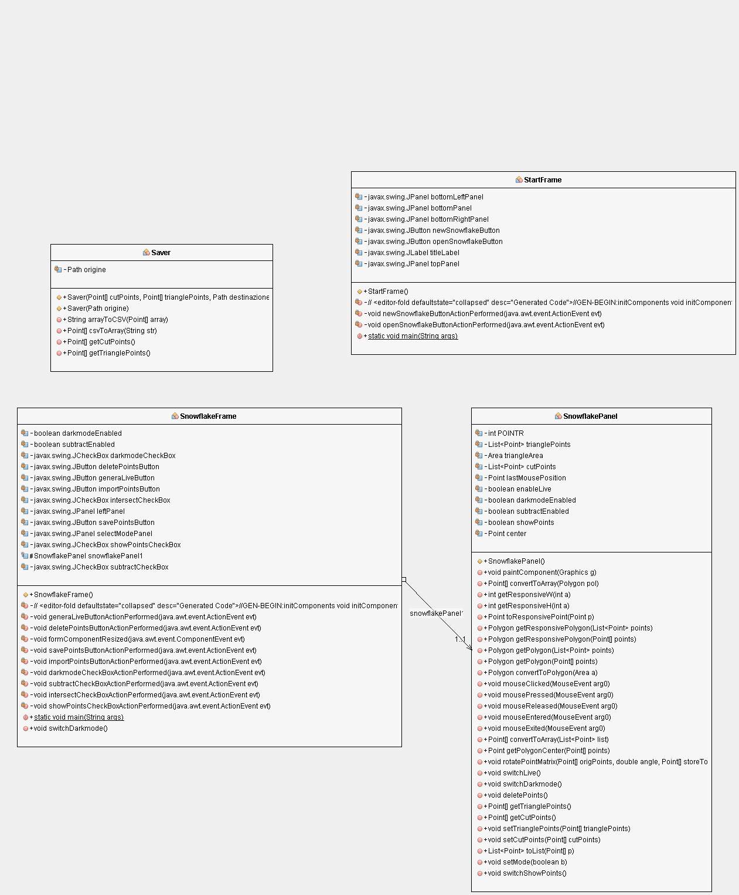
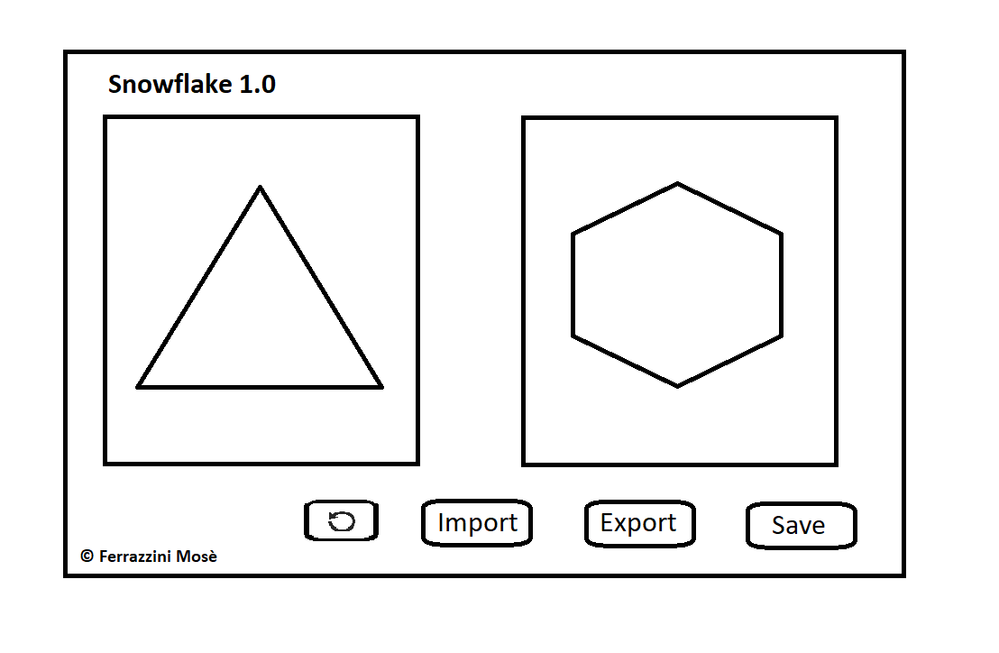

1. [Introduzione](#introduzione)

  - [Informazioni sul progetto](#informazioni-sul-progetto)

  - [Abstract](#abstract)

  - [Scopo](#scopo)

1. [Analisi](#analisi)

  - [Analisi del dominio](#analisi-del-dominio)

  - [Analisi dei mezzi](#analisi-dei-mezzi)

  - [Analisi e specifica dei requisiti](#analisi-e-specifica-dei-requisiti)

  - [Use case](#use-case)

  - [Pianificazione](#pianificazione)

1. [Progettazione](#progettazione)

  - [Design dell’architettura del sistema](#design-dell’architettura-del-sistema)

  - [Design dei dati e database](#design-dei-dati-e-database)

1. [Implementazione](#implementazione)

1. [Test](#test)

  - [Protocollo di test](#protocollo-di-test)

  - [Risultati test](#risultati-test)

  - [Mancanze/limitazioni conosciute](#mancanze/limitazioni-conosciute)

1. [Consuntivo](#consuntivo)

1. [Conclusioni](#conclusioni)

  - [Sviluppi futuri](#sviluppi-futuri)

  - [Considerazioni personali](#considerazioni-personali)

1. [Sitografia](#sitografia)

1. [Allegati](#allegati)

## Introduzione

### Informazioni sul progetto

  -   Allievo: Mosè Ferrazzini
  -   Docente/Committente: Geo Petrini

  -   Scuola Arti e Mestieri Trevano , Informatica, Modulo 306

  -   3	settembre	2019	–	20	dicembre	2019

### Abstract

  Alla SAM di Trevano gli allievi di terza della sezione informatica hanno ricevuto come progetto individuale per il primo semestre. Cioè un software che crea un fiocco di neve a partire da un triangolo ritagliabile dall'utente. Per farlo il software è stato implementato in Java. Il risultato è la simulazione della creazione di un fiocco di neve con un foglio di carta piegato e tagliato con le forbici.

### Scopo

  Lo scopo del progetto è quello di creare un programma in Java che partendo da un triangolo con dei tagli (come un foglio piegato) simuli l'apertura del foglio e quindi il fiocco di neve da esso derivato.

## Analisi

### Analisi del dominio

  Il prodotto dovrà funzionare sulle piattaforme che supportano java e dovrà creare un fiocco di neve a partire da un triangolo tagliato. Funzionerà come con la carta e le forbici, gli utenti saranno vari e l'uso del software sarà per svago e non per lavoro. Perciò il software sarà intuitivo e semplice da utilizzare per permettere agli utenti meno esperti di usufruirne.

### Analisi e specifica dei requisiti

  Il committente ha bisogno che il software sia funzionante e semplice da utilizzare.
  Il prodotto deve creare un fiocco di neve partendo da un triangolo ritagliato.
  L'utente dovrebbe ritagliare il triangolo da cui il software creerà il fiocco di neve.
  Per farlo verrà utilizzato un mouse o un touchscreen/touchpad.
  L'interfaccia dovrebbe mostrare un triangolo ritagliabile nella parte sinistra del software e il fiocco di neve risultante da esso sulla destra.
  Il programma deve almeno permettere di ritagliare il triangolo e mostrare il fiocco di neve.
  Il software non necessita di sicurezze particolari dato che non utilizza la rete.

  |**ID**	|**Nome**			|**Priorità**|**Vers**|**Note**  |
  |----|------------|--------|----|------|
  |Req-01|Il programma dovrà essere in Java|1|1.0|...|
  |Req-02|La finestra dovrà essere ridimensionabile|1|1.0|...|
  |Req-03|Si dovrà poter resettare o aggiungere i punti|1|1.0|...|
  |Req-04|Si dovranno poter creare uno o più poligoni|1|1.0|...|
  |Req-05|Ci dovrà essere un tasto per generare il fiocco di neve|1|1.0|...|
  |Req-06|Si deve poter salvare il fiocco di neve come immagine|1|1.0|...|
  |Req-07|La dimensione dell'immagine dovrà essere 500x500 Raster|1|1.0|...|
  |Req-08|Si deve poter salvare la posizione dei punti|1|1.0|...|
  |Req-09|Salvataggio in un file|1|1.0|...|
  |Req-10| Formato salvataggio punti --> JSON, CSV, o serializzazione di oggetti|1|1.0|...|
  |Req-11|Per importare esplora file o pagina che mostra direttamente tutti i file|1|1.0|...|
  |Req-12|Dovrà esserci un sito con download e descrizione del progetto|1|1.0|...|
  |Req-13|Nel sito dovranno esserci Lista req. di sistema, JRE, guida con screenshots|1|1.0|...|
  |Req-14|Fornire class per github, JAR per l'esecuzione|1|1.0|...|

### Use case

L'utente può tagliare il triangolo iniziale e
generarci un fiocco di neve dopodiché potrà salvare i punti
e ricaricarli quando vuole.

### Pianificazione

|**Nome**	|**Componente**|**Utilizzo**|
|---------|--------------|------------|
|New Snowflake|Button|Permette di creare un nuovo fiocco di neve.|
|Open Snowflake|Button|Permette di creare un nuovo fiocco di neve.|
|Genera live|Button|Attiva la generazione live del fiocco di neve.|
|Save Points|Button + FilePicker|Permette di salvare i punti in un file.|
|Import Points|Button + FilePicker|Permette di importare dei punti salvati in precedenza in un file.|
|Delete Points|Button|Cancella tutti i punti creati.|
|Subtract/Intersect|2 CheckBox|Permette di scegliere se usare il metodo Intersect o Subtract per creare il fiocco di neve.|
|Show Points|CheckBox|Permette di scegliere se vedere o no i punti creati.|
|Darkmode|CheckBox|Permette di attivare e disattivare la darkmode.|

### Analisi dei mezzi

 - 1 PC fornito dalla scuola con i tool necessari preinstallati

 - Portatile personale (Dell Vostro)

- JDK 12, Netbeans 11.1

Il software verrà eseguito su qualsiasi piattaforma supporti Java.

## Progettazione

Il programma avrà un triangolo ritagliabile tramite dei click del mouse o touchscreen/touchpad. Partendo da questo triangolo il software dovrà creare un fiocco di neve come se il triangolo fosse stato aperto (come con carta e forbici).

### Design dell’architettura del sistema
<h4>Diagramma UML del software</h4>

### Design dei dati e database

I dati sono salvati su diverse classi e si gestiscono tra di lavoro
attraverso setter e getter.

### Design delle interfacce

Durante il progetto ho cambiato idea sul come fare l'interfaccia e credo che il risultato finale sia meglio di quello che avevo progettato. Ho fatto in modo che il fiocco di neve si generi intorno al triangolo perché credo sia bello da vedere e diverso dagli altri. Inoltre ho aggiunto una Home dove si può creare o caricare il fiocco prima di iniziare.

<h4>Interfaccia progettata:</h4>

<h4>Interfacce finali:</h4>

### Design procedurale

[Documentazione java](javadoc/index.html/)

## Implementazione

Descrizione classi:

<h4>StartFrame:</h4>
Il frame che si apre inizialmente che permette di o creare un nuovo fiocco di neve o di importarlo da un file. Dopo la selezione di una delle due opzioni si passa a SnowflakeFrame.

<h4>SnowflakeFrame:</h4>
Si tratta del frame che ospita l'applicazione principale con i vari panel tra cui SnowflakePanel.

<h4>SnowflakePanel:</h4>
Si occupa di praticamente tutto il funzionamento dell'applicazione. Si occupa dei tagli del triangolo e della generazione del fiocco con tutte le funzioni in più come: Cancellare i punti, mettere la darkmode, nascondere i punti, ...

<h4>Saver:</h4>
Questa classe si occupa di salvare e importare da dei file .flake, e lo fa interagendo con la classe SnowflakePanel.

## Test

### Protocollo di test

|Test Case      | TC-001                         |
|---------------|--------------------------------------|
|**Nome**       |Aggiunta/rimozione dei punti |                          |
|**Descrizione**|I punti devono poter essere aggiunti con un click sinistro e rimossi con un click destro. |
|**Prerequisiti**|No. |
|**Procedura**     | Aprire la schermata principale del programma e creare dei punti cliccando con il tasto sinistro del mouse, dopodiché cliccare sopra ai punti per cancellarli.  |
|**Risultati attesi** |I punti vengono creati con il click sinistro e dopodiché possono essere cancellati con il click destro. |

|Test Case      | TC-002                             |
|---------------|--------------------------------------|
|**Nome**       |Taglio del triangolo. |                         |
|**Descrizione**|Appena vengono aggiunti almeno 3 punti il triangolo iniziale dovra cominciare a tagliarsi in base ad essi.|
|**Prerequisiti**|Aggiunta/rimozione dei punti |
|**Procedura**     | Aggiungere tre punti e controllare se il triangolo si taglia, dopodiché continuare ad aggiungerne e verificare che il triangolo continui a tagliarsi. |
|**Risultati attesi** |Da quando vengono aggiunti 3 punti il triangolo comincia a tagliarsi e aggiungendone il risultato continua a cambiare. |

|Test Case      | TC-003                               |
|---------------|--------------------------------------|
|**Nome**       |Generazione live del fiocco. |                         |
|**Descrizione**|Dopo aver cliccato sul Button "Genera live" l'applicazione dovrà generare in live il fiocco di neve risultante dal triangolo. |
|**Prerequisiti**|Taglio del triangolo |
|**Procedura**     | Inserire qualche punto per tagliare il triangolo, cliccare il Button "Genera live" e vedere se si genera il fiocco, dopodiché aggiungere ancora qualche punto e verificare che il fiocco si generi in live. |
|**Risultati attesi** |Dopo aver aggiunto i punti e tagliato il triangolo cliccando il Button "Genera live" si vede apparire il fiocco e continuando ad aggiungere punti il risultato continua a cambiare. |

|Test Case      | TC-004                               |
|---------------|--------------------------------------|
|**Nome**       |Salvataggio/Importazione dei punti. |                         |
|**Descrizione**|Tramite i due Button "Save Points" e "Import Points" i punti possono essere salvati e importati a piacimento.|
|**Prerequisiti**|Aggiunta/rimozione dei punti |
|**Procedura**     | Aggiungere qualche punto e utilizzare il Button "Save Points", salvare i punti, dopodiché cancellare i punti e ri-importare i punti con il Button "Import Points." |
|**Risultati attesi** |I punti vengono salvati nel file e dopo averli importati nel il progetto torna com'era quando è stato salvato. |

|Test Case      | TC-005                               |
|---------------|--------------------------------------|
|**Nome**       |Modalità Subtract/Intersect |                         |
|**Descrizione**|Grazie ai due CheckBox appositi si può scegliere se utilizzare la modalità intersect o subtract.|
|**Prerequisiti**|Taglio del triangolo. |
|**Procedura**     | Aggiungere qualche punto fino a quando il triangolo viene tagliato, dopodiché provare a cambiare subtract e intersect, facendolo il fiocco risultante dovrebbe cambiare. |
|**Risultati attesi** |Cambiando la modalità il fiocco risultante cambierà e si potrà avere due risultati con gli stessi punti. |

|Test Case      | TC-006                               |
|---------------|--------------------------------------|
|**Nome**       |Download dal sito web |                         |
|**Descrizione**|Dal sito web attraverso i due pulsanti di download si potrà scaricare il .jar e il source in .zip|
|**Prerequisiti**|Finire il codice e il sito web. |
|**Procedura**     | Andare sul sito e schiacciare i due pulsanti di download e verificare che i file si scarichino e siano corretti. |
|**Risultati attesi** |Il sito web funziona e con i pulsanti di download si possono scaricare i due file senza problemi. |

### Risultati test

<h5>TC-001</h5>
Con il click sinistro i punti si aggiungono e col tasto destro i punti si cancellano.

Test riuscito.

<h5>TC-002</h5>
Dopo aver aggiunto almeno 3 punti il triangolo comincia a cambiare.

Test riuscito.

<h5>TC-003</h5>
Cliccando su "Genera Live" il fiocco inizia a generarsi in live e cambia quando cambia il triangolo.

Test riuscito.

<h5>TC-004</h5>
I punti vengono salvati senza dare errori e quando vengono ri-importati funzionano come prima.

Test riuscito.

<h5>TC-005</h5>
Dopo aver attivato la generazione live cambiando la modalità da Intersect a Subtract e viceversa i tagli e il fiocco cambiano.

Test riuscito.

<h5>TC-006</h5>
Il sito web è raggiungibile e online, con i pulsanti i download del .jar e del .zip partono senza problemi.

Test riuscito.

### Mancanze/limitazioni conosciute

Purtroppo per vari motivi non sono riuscito a sviluppare tutto quello che volevo fare. Non sono riuscito a fare il responsive della pagina perché dopo aver generato il fiocco ho avuto dei problemi che mi hanno portato a dover bloccare la ridimensionizzazione della finestra. Invece per motivi di tempo non sono riuscito a implementare lo spostamento dei punti e il salvataggio dell'immagine.

## Consuntivo

Come ho già detto in precedenza in questo progetto non sono riuscito a gestirmi bene con il gantt, cercherò di farci più attenzione la prossima volta. Effetivamente credo che tenere un Gantt fatto bene mi avrebbe potuto aiutare.

## Conclusioni

Io credo che questo software non avrà un grande impatto su gli utenti che andranno a utilizzarlo, ma sicuramente ne ha avuto su di me che sono migliorato in programmazione e mi sono reso conto di alcune lacune che avevo. È vero che il software che ne è uscito non ha nessuna utilità, io personalmente non lo scaricherei mai, però per me è importante perché è solo una piccola parte della mia formazione che mi ha aiutato a crescere.

### Sviluppi futuri
  Credo che per migliorarlo bisognerebbe sicuramente aggiungere le features mancanti, ma anche sistemare un po' il codice separandolo in più classi perché non è molto ordinato.

### Considerazioni personali
  Ho imparato molto, come ho scritto anche sopra, questo progetto mi ha aiutato a migliorare in programmazione e mi ha fatto notare quanto sia importante un Gantt in un progetto. Credo che la prossima volta ci farò più attenzione in modo da poter gestire il tempo al meglio. Mentre per il mio feedback: Sono contento di aver sviluppato questo progetto perché è bello fare un po' di pratica oltre alla solita teoria che abbiamo fatto fino ad adesso.

## Allegati

Elenco degli allegati, esempio:

-   Diari di lavoro

-   Codici sorgente

-   [Sito Web](http://www.samtinfo.ch/i17fermos).
